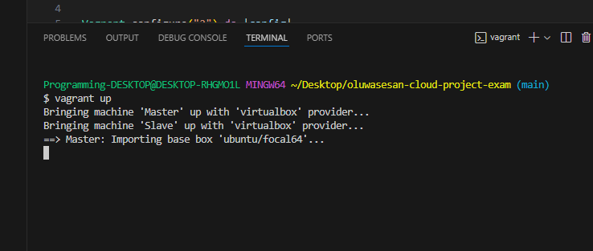

# EXAM PROJECT DOCUMENTATION 
### The project contains the automation and provisioning of two Ubuntu-based servers, named “master” and “slave”, using Vagrant, with a bash script to automate the deployment of a LAMP (Linux, Apache, MySQL, PHP) stack, and cloned a PHP application from GitHub, with all necessary packages, and configured Apache web server and MySQL while using ansible to execute the bash script on the Slave node and cronjob to create check the server's uptime every 12:00am. the bash script is reusable and readable and can be accessible through the following repository: https://github.com/lukacaleb/MasterSlave-exams.git

### 1. Provisioning of "master" and "slave"
the file "vagrant-up.sh" when runned/executed, spines up the two ubuntu master and slave machines while creating a vagrantfile.  

### 2.  ssh into both "master" and "slave"
the 

### 3.  bash script for the installation of LAMP

this step details the swcript that will be deployed on the slave using the ansible.... however fpor this step the script was only tested on the master-node to be sure its woirking

### 4.  successful deployment of LAMP (lavravel) on master-node

when the bash script ran successfully, here are the snapshotd of the successful deployment

### 5.  Installing ansible and pinging the slave from the master

here ansible was successfully installed on my master-node and the slave node was pinged from the master-node

#### a. Ansible.cfg:- This is the brain and the heart of Ansible, the file that governs the behavior of all interactions performed by the control node.

#### b. Iventory:-the inventory is a list of managed nodes, or hosts, that Ansible deploys and configures. this inventory carries the ip address of the slave node in this project.

#### c. slave-lamp-deploy.yml:- the Ansible Playbook in this project contains the blueprint of automation tasks on the slave node, which are IT actions executed with limited manual effort, across an inventory of IT solutions.

Here is my ansible playbook

### 6. the successful installation of LAMP on slave-node using ansible

after running the play book using ansible-playbook -i inventory slave-lamp-deploy.yml in the ansible dir; below are the results and the snapshots of the display of laravel page on my slave-node

display of the successful running of my playbook (slave-lamp-deploy.yml) on my master terminal

display of laravel on my slave-node/ip

### 7. Running crontab

I added crontab to my bash script so it can be automatically installed when I am running my playbook

a. addition of crontab installation to script

b.  ran the script again to add the cronjob and it was successful

c. went to the slave noide to confirm that the cron job was successful and offcourse it was.

d. confirmation of the cron job from my slave-node

